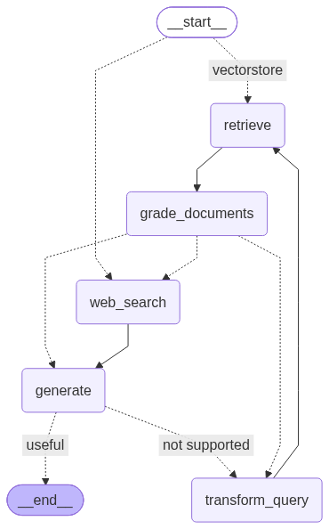

# Agentic RAG with LangGraph — Hybrid Search + Reranking

[](https://hub.docker.com/repository/docker/mirzaasadijaz/agentic-rag-langgraph/general)


An LLM-driven **agentic RAG** system built on LangGraph. The agent routes each
question, retrieves with **hybrid search** (dense + BM25) and **cross-encoder
reranking**, grades what it found, and corrects itself when the results are
weak — all behind a Streamlit chat UI where you can upload your own documents.



## Features

- **Agentic control flow** — route → retrieve → grade → generate → self-check,
  with automatic query rewriting and a web-search fallback.
- **Hybrid retrieval** — Chroma dense vectors + BM25 keyword search, fused with
  weighted Reciprocal Rank Fusion.
- **Local reranking** — FlashRank cross-encoder (ONNX, no API key, no PyTorch
  needed for this step).
- **Streamlit chat UI** — live agent timeline, per-answer sources and steps,
  LaTeX and syntax-highlighted code rendering, chat export to Markdown.
- **Bring your own documents** — upload files from the sidebar and they are
  indexed on the spot.
- **Guaranteed termination** — every retry loop is capped by `MAX_RETRIES`.
- **Docker-ready** — published on Docker Hub, CPU-only PyTorch, runs as a
  non-root user, secrets never baked into the image.

## Quick start

### Option A — Docker (recommended)

Pull the prebuilt image:

```bash
docker pull mirzaasadijaz/agentic-rag-langgraph:latest
```

Or build it yourself and run it with Compose:

```bash
cp .env.example .env            # then fill in your API keys
docker compose build
docker compose up               # use `up`, not `run` - this serves a web app
```

Open **http://localhost:8502**. (The container listens on 8501; Compose maps it
to 8502 on your machine. Change the left-hand number in `docker-compose.yml`
if that port is taken.)

Running the pulled image without Compose:

```bash
docker run --rm -p 8502:8501 --env-file .env \
  -v chroma-db:/app/chroma_db \
  -v model-cache:/app/.cache \
  mirzaasadijaz/agentic-rag-langgraph:latest
```

### Option B — Local Python

```bash
pip install -r requirements.txt
cp .env.example .env            # then fill in your API keys

python ingest.py                # optional: index everything in DATA_DIR
streamlit run app.py
```

You can skip `ingest.py` and upload documents from the sidebar instead.

## Configuration

Copy `.env.example` to `.env` and set:

| Variable | Required | Purpose |
|---|---|---|
| `GROQ_API_KEY` | Yes | Grading role: routing, grading, query rewriting ([console.groq.com](https://console.groq.com)) |
| `GOOGLE_API_KEY` | Yes | Generation role: the final answer ([aistudio.google.com](https://aistudio.google.com/apikey)) |
| `TAVILY_API_KEY` | For web fallback | Web-search fallback node ([tavily.com](https://tavily.com), free tier) |
| `HF_TOKEN` | No | Only for gated or rate-limited HuggingFace downloads. Leave it out rather than using a placeholder — an invalid token causes 401 errors |

The app checks for required keys on startup and shows a clear error if any are
missing. Optional overrides (models, providers, paths) are listed at the bottom
of `.env.example`; their defaults live in `src/config.py`.

## How it works

The agent is a LangGraph `StateGraph` (diagram above). Each step:

| Node | What it does |
|---|---|
| **route** (entry) | An LLM decides whether the question goes to the vector store or straight to web search |
| `retrieve` | Hybrid search + cross-encoder rerank over your documents |
| `grade_documents` | An LLM grades each retrieved chunk for relevance, then picks the next step: generate, rewrite the query, or fall back to the web |
| `transform_query` | Rewrites the question for a better retrieval attempt, then loops back to `retrieve` |
| `web_search` | Tavily fallback when the local documents can't answer |
| `generate` | Produces the answer from the surviving context, then checks it for hallucinations and usefulness. Unsupported answers loop back through `transform_query` |

This is the Corrective / Self-RAG pattern. Every loop increments `retry_count`
in the graph state and every decision point checks it against `MAX_RETRIES`,
so the graph always terminates.

### Hybrid search and reranking

Both live in `src/retrieval.py` and run locally:

1. **Dense retriever** — Chroma over local `sentence-transformers` embeddings.
   Catches paraphrases ("what if I run out of space?").
2. **Sparse retriever** — `BM25Retriever`. Catches exact IDs and error codes
   that embeddings blur together.
3. **Fusion** — `EnsembleRetriever` merges both ranked lists with weighted
   Reciprocal Rank Fusion (`DENSE_WEIGHT` / `SPARSE_WEIGHT`).
4. **Reranking** — `FlashrankRerank` rescores each `(query, document)` pair
   jointly and keeps the top `RERANK_TOP_N`. It is more accurate than comparing
   embeddings but too slow for a whole corpus, so it only sees the candidates
   hybrid search already narrowed down.

To see the effect on a real query:

```bash
python compare_retrieval.py "What happens if I go over my storage quota?"
# in Docker:
docker compose run --rm agentic-rag compare_retrieval.py "your question"
```

### Two LLM roles

`src/llm.py` splits the work across two models instead of one:

| Role | Used by | Default | Why |
|---|---|---|---|
| **grading** | routing, all graders, query rewriting | Groq `llama-3.3-70b-versatile` | Fires constantly (once per document, per loop) on simple structured decisions — fast, cheap inference keeps the agent responsive |
| **generation** | the final answer | Google `gemini-3.8-flash` | Called once per turn, so it's worth spending more for better-written answers |

Override either role in `.env` (`GRADING_LLM_PROVIDER`, `GENERATION_LLM_PROVIDER`
and the matching `*_LLM_MODEL` variables), or add a provider in
`_build_chat_model()` in `src/llm.py`.

## Using the app

- **Ask** a question in the chat box, or click one of the example prompts.
- **Watch** each agent node appear live in the timeline while it works.
- **Inspect** any answer through *Sources and steps*: the retrieved passages
  (with page numbers where available), the agent's step-by-step trace, and the
  raw Markdown to copy.
- **Upload** documents from the sidebar and click *Add to knowledge base*. The
  index is rebuilt and the retriever refreshed automatically.
- **Export** the conversation as Markdown, clear it, or render the agent graph
  from the sidebar (the diagram fetch needs internet access).

## Docker details

| Mounted at | What it holds |
|---|---|
| `/app/chroma_db` (named volume) | the Chroma vector index |
| `/app/.cache` (named volume) | downloaded embedding and reranker models |
| `/app/data` (bind mount of `./data`) | your source documents |

The named volumes survive restarts, so models download and indexing happen
once. `docker compose down -v` wipes both.

- **Secrets stay out of the image.** Keys arrive at runtime through
  `env_file: .env`, and `.dockerignore` keeps `.env` out of the build.
- **Uploads from the UI need a writable data folder.** `docker-compose.yml`
  mounts `./data` read-only (`:ro`). Remove the `:ro` if you want to use the
  sidebar uploader inside Docker; otherwise add files to `./data` on your
  machine and run `docker compose run --rm agentic-rag ingest.py`.
- **Re-ingest after editing documents.** BM25 is rebuilt in memory at every
  start, but the dense index only updates when you re-ingest, so until then the
  two halves of hybrid search disagree.
- **CPU-only PyTorch** is installed by default to avoid several GB of unused
  CUDA libraries. For a GPU build:
  `docker compose build --build-arg TORCH_INDEX_URL=https://pypi.org/simple`
- **Runs as an unprivileged user** (uid 1000).
- **One-off scripts:** the image entrypoint is `python`, so
  `docker compose run --rm agentic-rag ingest.py` works for any script.
- **Need a shell?** `docker compose run --rm --entrypoint bash agentic-rag`

## Project layout

```
├── app.py                    # Streamlit chat UI
├── ingest.py                 # builds the Chroma index (safe to re-run)
├── compare_retrieval.py      # hybrid results before/after reranking
├── visualize_graph.py        # exports graph_diagram.mmd and graph_diagram.png
├── graph_diagram.mmd / .png  # the agent graph
├── src/
│   ├── config.py             # every tunable knob (models, weights, k, retries)
│   ├── state.py              # GraphState TypedDict
│   ├── retrieval.py          # hybrid search + reranking
│   ├── prompts.py            # prompt templates
│   ├── schemas.py            # pydantic structured-output schemas
│   ├── chains.py             # LCEL chains (router/graders/generation/rewriter)
│   ├── llm.py                # factory for the grading + generation models
│   ├── tools.py              # Tavily web-search fallback
│   ├── nodes.py              # graph nodes and conditional edges
│   └── graph.py              # wires everything into a StateGraph
├── data/sample_docs/         # demo knowledge base (fictional "Nimbus Cloud Storage")
├── tests/                    # pytest suite
├── Dockerfile
├── docker-compose.yml
├── .dockerignore
├── .github/workflows/ci.yml  # tests + Docker build on every push / PR
├── requirements.txt          # runtime dependencies
├── requirements-dev.txt      # runtime + pytest
├── .env.example              # template for your API keys
├── .gitignore
└── .gitattributes            # normalizes line endings to LF
```

## Tuning

Everything is in `src/config.py`:

| Setting | Default | Effect |
|---|---|---|
| `GRADING_LLM_PROVIDER` / `_MODEL` | `groq` / `llama-3.3-70b-versatile` | Model behind routing, grading, and rewriting |
| `GENERATION_LLM_PROVIDER` / `_MODEL` | `google` / `gemini-3.8-flash` | Model behind the final answer |
| `DENSE_K` / `SPARSE_K` | 6 / 6 | Candidates pulled from each retriever before fusion |
| `DENSE_WEIGHT` / `SPARSE_WEIGHT` | 0.5 / 0.5 | Fusion weighting — raise `SPARSE_WEIGHT` for corpora heavy on exact IDs or codes |
| `RERANK_TOP_N` | 4 | Documents kept after reranking, i.e. what the LLM sees |
| `MAX_RETRIES` | 2 | Caps every rewrite/retry loop |

## Swapping components

- **LLM providers** — add an `elif` in `_build_chat_model()` (`src/llm.py`) for
  `ChatOpenAI`, `ChatAnthropic`, or any `BaseChatModel`, then point the
  provider variables at it.
- **Embeddings** — change `EMBEDDING_MODEL` to any `sentence-transformers`
  model (e.g. a larger `BAAI/bge-*`), or replace the body of `get_embeddings()`
  to use a hosted embedding API.
- **Reranker** — swap `FlashrankRerank` in `get_reranker()` for
  `CrossEncoderReranker` with a `BAAI/bge-reranker-*` model, or a hosted
  reranker such as Cohere's.
- **Vector store** — any LangChain `VectorStore` (FAISS, Pinecone, Qdrant, …)
  is a drop-in replacement for the Chroma retriever.

## Testing and CI

```bash
pip install -r requirements-dev.txt
python -m pytest tests/ -v
```

- `test_retrieval.py` — chunking and BM25 run for real; the dense half is a
  lightweight fake so the suite stays offline, while the real
  `EnsembleRetriever` fusion path is still exercised. Also covers index
  rebuilds (never duplicated) and reranker wiring.
- `test_llm.py` — both providers construct correctly, unknown providers fail
  loudly, and structured-output chains work. Uses dummy keys; no network.
- `test_graph.py` — runs the **compiled graph** with every LLM call mocked:
  the happy path, the "no relevant docs → retries → web search" loop, the
  "hallucinated generation → retries → forced termination" loop, and direct
  web-search routing.

GitHub Actions (`.github/workflows/ci.yml`) runs on every PR and push to `main`:
a **test** job (no secrets needed, safe for forks) and a **docker-build** job
that builds the image and smoke-tests it by compiling the graph inside the
container.

## Exporting the graph diagram

```bash
python visualize_graph.py
```

Writes `graph_diagram.mmd` (Mermaid source) and `graph_diagram.png`. PNG
rendering uses mermaid.ink and needs internet access; if it fails, paste the
`.mmd` contents into [mermaid.live](https://mermaid.live).

## Notes on versions

This project targets **LangChain 1.x / LangGraph 1.x** (verified against
`langgraph==1.2.12` and `langchain==1.4.2`). If you're following an older
tutorial: `EnsembleRetriever` and `ContextualCompressionRetriever` moved from
`langchain.retrievers` to `langchain_classic.retrievers` in LangChain 1.0,
which is why `requirements.txt` includes `langchain-classic`.

Hosted model lineups change often. If a model name starts returning 404, check
[console.groq.com/docs/models](https://console.groq.com/docs/models) or
[ai.google.dev/gemini-api/docs/models](https://ai.google.dev/gemini-api/docs/models)
and update `.env` — nothing else needs to change.